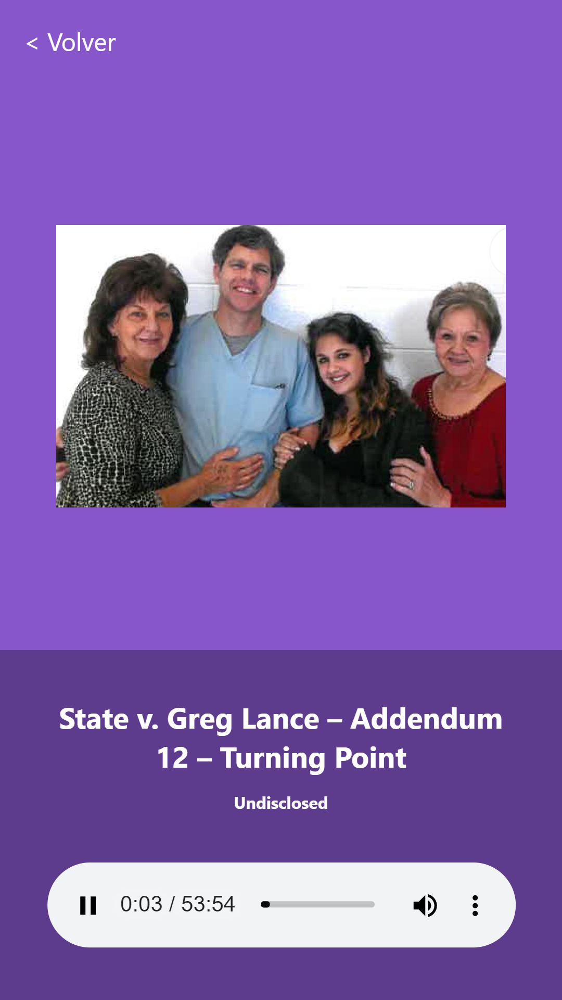

# App de Podcast 

App de Podcast integrada con la API de AudioBoom para aprender Next.js

[Ver la aplicacion](https://podcast.royhg1496.now.sh)

## Como funciona?

Requiere Node.js 10 o superior

* `npm install` para instalar las dependencias.
* `npm run dev` para el entorno de desarrollo.
* `npm run build && npm start` para el entorno de produccion.

## Licencia 